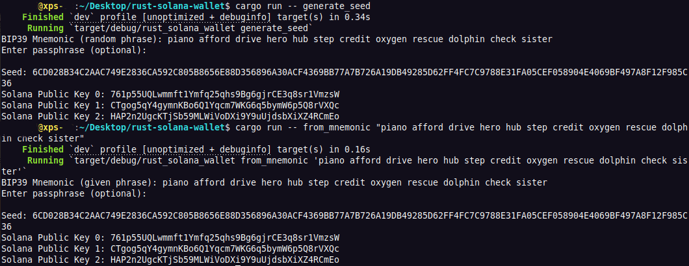

# Solana Wallet in Rust - Example

<a href="https://github.com/s-damian/rust-solana-wallet">

</a>
<a href="https://github.com/s-damian/rust-solana-wallet">

</a>

> #Solana #Wallet #Rust #BIP39 #Web3 #Blockchain

> This is an example of a **Solana Wallet** in **Rust** 🦀

[](https://github.com/s-damian/rust-solana-wallet/actions/workflows/tests.yml)
[](https://github.com/s-damian/rust-solana-wallet/actions/workflows/static-analysis.yml)
[](https://github.com/s-damian/rust-solana-wallet/blob/main/LICENSE)

This **example of a Solana Wallet** is developed by [Stephen Damian](https://github.com/s-damian)


## Summary

- [Feature Summary](#feature-summary)
- [Wallet Commands Summary](#wallet-commands-summary)
- [Project Overview](#project-overview)
- [Roadmap](#roadmap)
- [Prerequisites](#prerequisites)
- [Setup](#setup)
- [How to use?](#how-to-use)
  - [generate_seed command](#-generate_seed-command)
  - [recover_seed command](#-recover_seed-command)
  - [send command](#-send-command)
  - [pubkey command](#-pubkey-command)
  - [balance_by_pubkey command](#-balance_by_pubkey-command)
- [Environment Variables](#environment-variables)
- [Some Interesting Links](#some-interesting-links)
- [Security](#security)
- [FAQ](#faq)
- [Various Documentations](#various-documentations)
- [License](#license)


## Feature Summary

This wallet manages:

- **Generate Mnemonic**: Creates a new random BIP39 mnemonic phrase.
- **Seed**: Derives a seed from the mnemonic phrase.
- **Passphrase**: You can optionally use a passphrase.
- **Keypair Generation**: Generates a Solana keypair (public and private key) from the derived seed.
- **Keypair Storage**: Saves the generated keypair to a local JSON file for future use.
- **Key Derivation**: Supports generating multiple keypairs from a single seed by applying BIP44 derivation paths.
- **Send SOL (lamports)**: Send SOL to a recipient address (sign outgoing transaction).
- **Public Key Display**: Retrieves and displays the public key from the locally stored keypair.
- **Get Balance**: Get balance (in SOL and in lamports) by public key.


## Wallet Commands Summary

| Command | Description 
|--------------------------------|---|
| [generate_seed](#-generate_seed-command) | Generates a 12-word BIP39 mnemonic phrase, derives the corresponding seed, saves the keypair, and displays the public key. |
| [recover_seed](#-recover_seed-command) | Accepts a user-provided BIP39 mnemonic phrase, derives the corresponding seed, saves the keypair, and displays the public key. |
| [send](#-send-command) | Send SOL to a recipient address. |
| [pubkey](#-pubkey-command) | Displays the public key from a keypair stored in a JSON file. |
| [balance_by_pubkey](#-balance_by_pubkey-command) | Get balance by public key. |

To see a summary of all available commands and options:

```bash
cargo run -- --help
```


## Project Overview

Rust Solana Wallet - A lightweight Solana wallet developed in Rust.

**Status**: Under development 🚧




## Roadmap

- ✅ Command-line interface (CLI) implementation.
- ✅ Testing : Functional tests / Unit tests.
- ⬜ Graphical user interface (GUI) implementation.
- ⬜ Add support for SPL tokens.


## Prerequisites

- **Rust** `>= 1.75.0` (last tested: `1.80.0`) - Ensure Rust is installed on your system. You can install Rust using [Rustup](https://rustup.rs/).
- **Cargo** - Rust's package manager, installed automatically with Rust. Learn more about Cargo [here](https://doc.rust-lang.org/cargo/).


## Setup

Clone the repository:

```bash
git clone https://github.com/s-damian/rust-solana-wallet.git
```

Navigate to the project directory:

```bash
cd /<your-path>/rust-solana-wallet
```

Create your ```.env``` file:

```bash
cp .env.example .env
```


## How to use?

**Keypair storage**:

`generate_seed` and `recover_seed` commands write the generated keypair to the `<project-directory>/storage/keypair/id.json` file (`KEYPAIR_PATH` env var), allowing you to store or utilize the keypair in your Solana applications.

**Multiple keypairs (derivations)**:

If you want to generate several keypairs and several public keys with a single mnemonic phrase, you must set the `NB_DERIVATIONS` environment variable to a value greater than `1`.

Your non-derived keypair will be created in your `<project-directory>/storage/keypair/id.json` file (`KEYPAIR_PATH` env var) JSON file.

The other keypairs (which will be derived from your seed) will be created in JSON files in your `<project-directory>/storage/keypair/derived` directory (`KEYPAIR_DIR` env var).

### 🌐 generate_seed command

> Generate and display a random mnemonic phrase.

This command generates a new mnemonic phrase randomly, calculates the corresponding seed, displays the seed, displays the Solana public key, and generates and writes the keypair to the JSON file.

- Command:

```bash
cargo run -- generate_seed
```

**Optional passphrase:** You will be prompted to enter a passphrase (leave blank to not use one).

- Example of result (with `NB_DERIVATIONS=3`):

```bash
BIP39 Mnemonic (random phrase): shed scorpion manual wheat monster phone winter toe dream kitchen salad column
Seed: 34A0EACFFDF41445C0B7E43C2D730C54F4CD1D8334528F73E3D5F2C2977FAABA7CAD88EBDA6A1F02CE6BB596F04036305A32B96303F93FF864D268539739AFF8
Solana Public Key: FTGJPL5hia749v3jhNWJA7uE2VoVGyofB7BBL2cLwoPc
Solana Public Key (derivation 1): EMLY3VvNZ41yMWyPQy2AiEfJTPpZdzeGNG5zaaq3Lihb
Solana Public Key (derivation 2): 8PnmS7rp3hRTSqGJkYedm8tavYuDfLjBJJL9ssBuyAis
Solana Public Key (derivation 3): 7rdf3btc5zNA7TXvA3Jc31VKnYRdc9goLmFYy6mEjbTv
```

Here, since we wanted 3 derivations, this generated 4 accounts (4 public keys) for us.

### 🌐 recover_seed command

> Generate and display a seed and Solana public key from a specific phrase.

> Command with arguments: cargo run -- recover_seed `<RECOVERY_PHRASE>`

To generate and display the seed and Solana public key from a specific mnemonic phrase, pass the phrase (12 or 24 words, for example) as an argument.

This will also generate and write the keypair to the JSON file.

**Example** with this 12 words: `shed` `scorpion` `manual` `wheat` `monster` `phone` `winter` `toe` `dream` `kitchen` `salad` `column`.

- Command:

```bash
cargo run -- recover_seed "shed scorpion manual wheat monster phone winter toe dream kitchen salad column"
```

**Optional passphrase:** You will be prompted to enter a passphrase (leave blank to not use one).

- Example of result (with `NB_DERIVATIONS=3`):

```bash
BIP39 Mnemonic (given phrase): shed scorpion manual wheat monster phone winter toe dream kitchen salad column
Seed: 34A0EACFFDF41445C0B7E43C2D730C54F4CD1D8334528F73E3D5F2C2977FAABA7CAD88EBDA6A1F02CE6BB596F04036305A32B96303F93FF864D268539739AFF8
Solana Public Key: FTGJPL5hia749v3jhNWJA7uE2VoVGyofB7BBL2cLwoPc
Solana Public Key (derivation 1): EMLY3VvNZ41yMWyPQy2AiEfJTPpZdzeGNG5zaaq3Lihb
Solana Public Key (derivation 2): 8PnmS7rp3hRTSqGJkYedm8tavYuDfLjBJJL9ssBuyAis
Solana Public Key (derivation 3): 7rdf3btc5zNA7TXvA3Jc31VKnYRdc9goLmFYy6mEjbTv
```

Here, since we wanted 3 derivations, this generated 4 accounts (4 public keys) for us.

### 🌐 send command

> Send SOL (lamports) to a recipient address (sign outgoing transaction).

> Command with arguments: cargo run -- send `<RECIPIENT_PUBKEY>` `<AMOUNT_IN_LAMPORTS>`

This command allows you to sign an outgoing transaction from your wallet to a destination address.

**Example** to send `0.002` SOL (`2000000` lamports) to recipient address `EMLY3VvNZ41yMWyPQy2AiEfJTPpZdzeGNG5zaaq3Lihb`.

- Command:

```bash
cargo run -- send EMLY3VvNZ41yMWyPQy2AiEfJTPpZdzeGNG5zaaq3Lihb 2000000
```

This command will sign the transaction with the keypair which is stored in the file `<project-directory>/storage/keypair/id.json` file (`KEYPAIR_PATH` env var).

- Example of result (when successfully):

```bash
Transaction sent successfully!
```

- Example of result (when it fails):

```bash
Failed to send transaction: ...
```

### 🌐 pubkey command

> Retrieve public key from stored keypair.

This is useful for retrieving your Solana public key if you have already generated and stored your keypair locally.

This command reads your JSON keypair file stored, extracts the public key, and displays it.

- Command:

```bash
cargo run -- pubkey
```

This command reads the keypair stored in `<project-directory>/storage/keypair/id.json` file (`KEYPAIR_PATH` env var).

- Example of result:

```bash
Solana Public Key: FTGJPL5hia749v3jhNWJA7uE2VoVGyofB7BBL2cLwoPc
```

### 🌐 balance_by_pubkey command

> Get balance by public key.

> Command with arguments: cargo run -- balance_by_pubkey `<PUBKEY>`

This command allows you to see the balance (in SOL and in lamports) of a public address.

**Example** to see the balance of the public address `EMLY3VvNZ41yMWyPQy2AiEfJTPpZdzeGNG5zaaq3Lihb`.

- Command:

```bash
cargo run -- balance_by_pubkey EMLY3VvNZ41yMWyPQy2AiEfJTPpZdzeGNG5zaaq3Lihb
```

- Example of result:

```bash
Balance: 0.005910000 SOL (5910000 lamports)
```


## Environment Variables

Environment variables are configured in the `.env` file.

You can configure these environment variables:
- `NB_DERIVATIONS` (default value: `0`).
- `KEYPAIR_PATH` (default value: `./storage/keypair/id.json`).
- `KEYPAIR_DIR` (default value: `./storage/keypair/derived`).
  - Note: `KEYPAIR_DIR` is only useful if `NB_DERIVATIONS` is > `0`.
- `RPC_URL` (default value: `https://api.testnet.solana.com`).


## Some Interesting Links

- **BIP39**: Learn more about the **BIP39** standard [here](https://github.com/bitcoin/bips/blob/master/bip-0039.mediawiki).
- **SLIP44**: Learn more about the **SLIP44** [here](https://github.com/satoshilabs/slips/blob/master/slip-0044.md).


## Security

This wallet is an example and should not be used to store large amounts of SOL without a thorough security review. Always make sure to back up your mnemonic phrases and private keys in a secure location.


## FAQ

**Q**: Can this wallet be used on the Solana mainnet?

**A**: While technically possible, this wallet is designed as an educational example and is not recommended for use on the mainnet without a thorough security review.


## Various Documentations

- See further technical details here:
[Notes-tech.md](./docs/Notes-tech.md)


## License

This project is licensed under the MIT License. See the [LICENSE](./LICENSE) file for more details.
